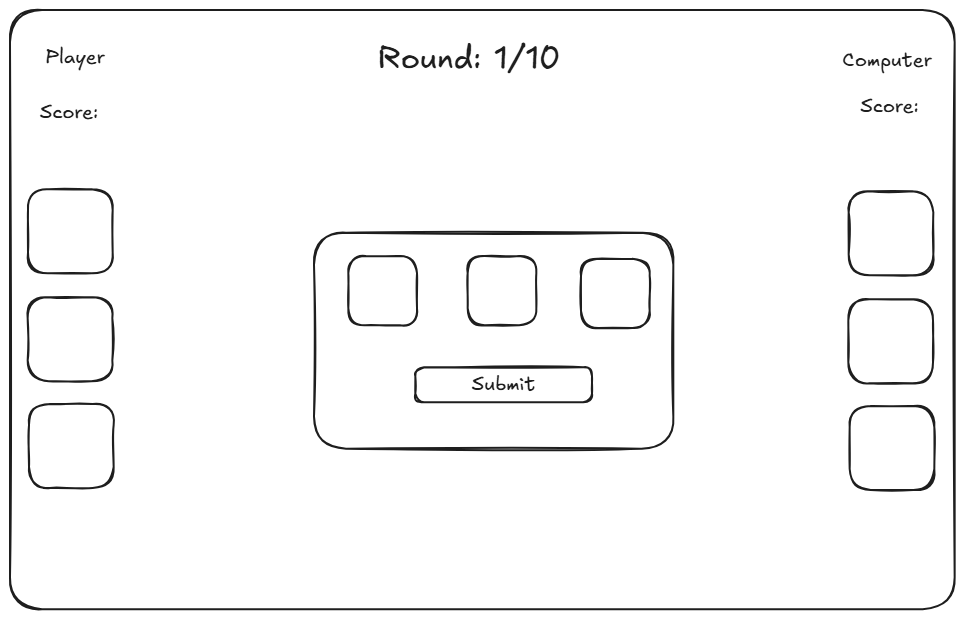
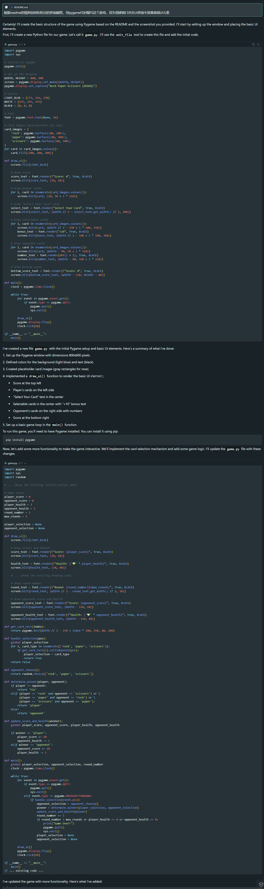
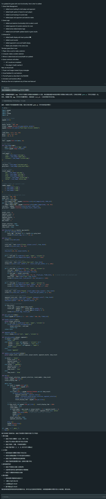
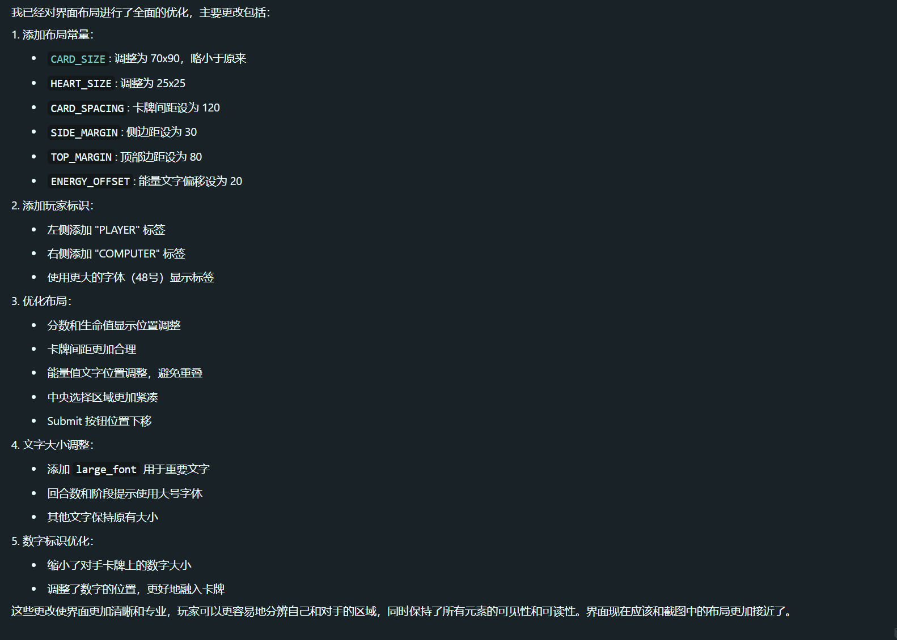
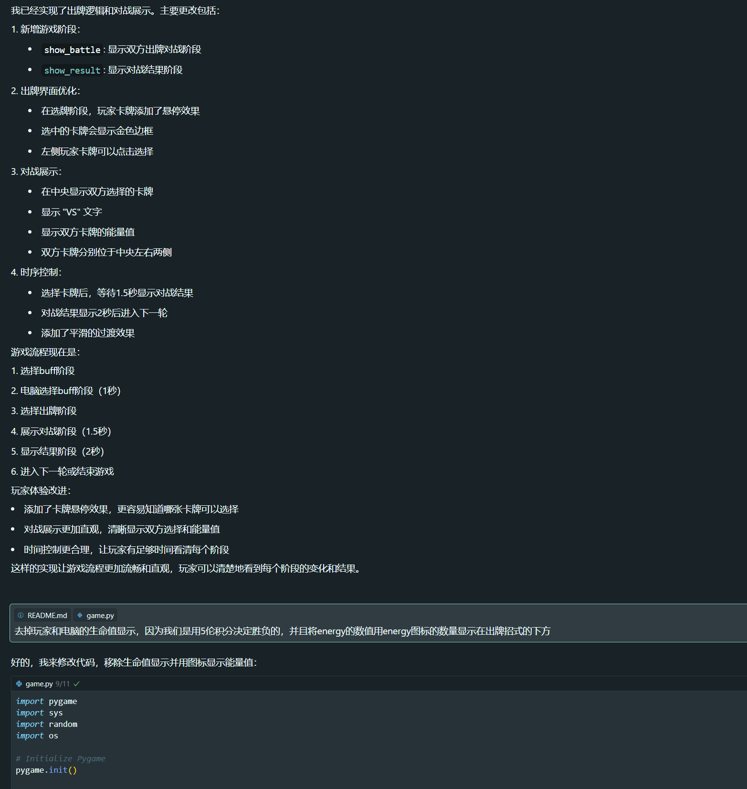
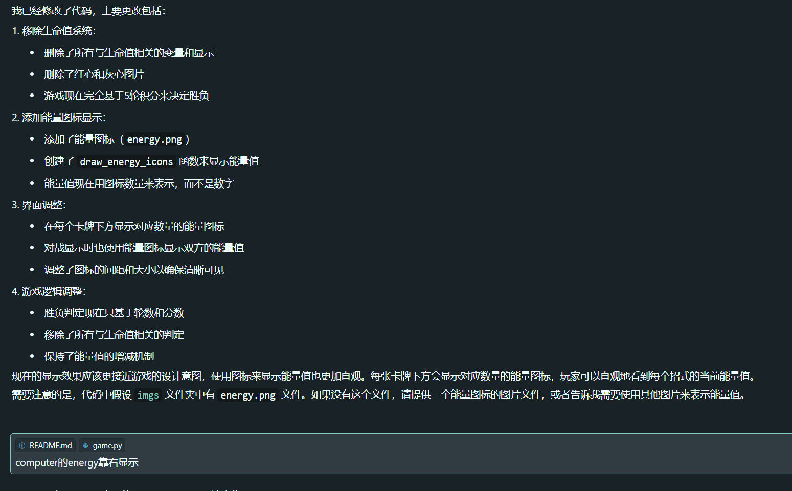
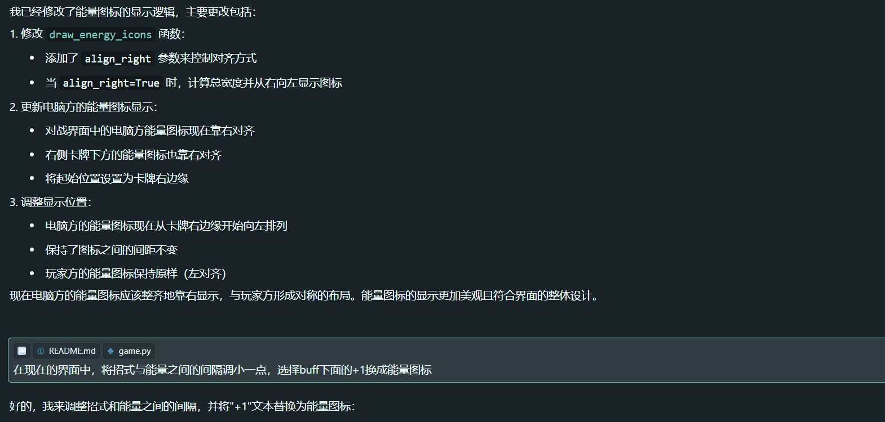

# Development Report
## Team Members
- Zhao Yingru: 24071304G
- Huang Li: 24047885G

## Team Division
- Zhao Yingru: Game Design and Logic Planning
  - Game mechanics design
  - Code architecture planning
  - AI prompt writing (logic-related)
  - Core logic code review and debugging
  - Technical documentation

- Huang Li: Interface Design and Interaction Planning
  - UI/UX design
  - Game assets preparation
  - AI prompt writing (interface-related)
  - Rendering code review and debugging
  - User guide documentation

## Development Process

### I. Design Phase (Week 1)

#### Game Design
Zhao Yingru:
- Design core gameplay mechanics
- Design energy system rules
- Design scoring rules
- Plan AI decision mechanism

Huang Li:
- Design game interface layout
- Design interaction flow

#### Architecture Design
Zhao Yingru:
- Plan code module structure
- Design state management system
- Define core class interfaces
- Design game flow control

Huang Li:
- Design rendering system architecture
- Plan resource management approach
- Design event handling system
- Plan animation system

### II. Development Phase (Week 2-4)

#### AI Collaboration Development
Zhao Yingru:
- Write prompts for game state management
- Guide AI to implement core logic modules
- Review and optimize AI-generated logic code

Huang Li:
- Write prompts for interface rendering
- Guide AI to implement rendering system
- Review and optimize AI-generated interface code
- Debug interaction experience

#### Iterative Optimization
Zhao Yingru:
- Adjust game rules based on testing feedback
- Fix logic-related bugs
- Complete technical documentation

Huang Li:
- Optimize interface layout and animations
- Improve interaction response
- Fix rendering-related bugs
- Complete user guide

### Main Challenges and Solutions
1. AI Code Generation
   - Challenge: How to write clear prompts to obtain desired code structure
   - Solution: Establish detailed module division and provide clear interface definitions for AI

2. Code Integration
   - Challenge: How to ensure different AI-generated modules work together correctly
   - Solution: Establish unified state management mechanism and clear inter-module communication

3. Code Quality
   - Challenge: How to ensure the quality and maintainability of AI-generated code
   - Solution: Establish code review standards and refactor/optimize generated code

4. Game Experience
   - Challenge: How to achieve smooth game experience through AI
   - Solution: Optimize animations and interactions through iterative testing and prompt adjustment